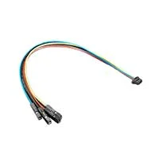

# signalk-9axis-bno08x-imu
SignalK plugin to get heading and attitude sensor data from BNO080/85/86 9-axis IMU family (see [here](https://docs.sparkfun.com/SparkFun_VR_IMU_Breakout_BNO086_QWIIC/introduction/))
There are many other sources of similar breakout boards (let you search the web with "BNO086 breakout") available from e-commerce platforms like Aliexpress, Amazon etc.

In the './doc' folder you can find the CEVA BNO08x (the IMU chip at the heart of the breakout) datasheet.

The adoption of QWIIC(STEMMA) cabling is optional but highly recommended if you wish to avoid the soldering of a pin strip and to minimize physical dimensions of hardware layout.

### Board image (example)
 

### Stemma cable (qwiic) with female dupont endings in order to connect to SBC header pins

The project uses the I2C protocol alternative (but also serial or SPI are available) to let the SBC communicate to the breakout board. Due to some glitch on the I2C protocol implementation in BNO08X chips ensure the bus in your SBC is configured in high speed (clock speed set at 400000), eventually configuring it at "dts" level and rebooting. The project is based on Adafruit Blinka Python Library that let you use CircuitPython environment (with some minor limitations) in a full python3 installation like the one available on Raspbian (Raspberry Pi) or Debian (for other SBCs like Radxa Rock series -tested on Rock-4Se-). Adafruit has a "CircuitPython-based" library for BNO08x family IMU sensors  (see [here] (https://docs.circuitpython.org/projects/bno08x/en/latest/)).
#### [Note]
Depending on the wiring of the breakout board, the default I2C address may be 0x4A [74] or 0x4B [75]. The plugin scans I2C bus to find the actual address (if any) and compares it with the one defined in parameters 'schema' logging a warning if the address found is different from the one defined. Absence of either adresses in the bus forces the plugin to stop.

### before installing plugin

the following steps are required only for the first installation of the plugin. 

#### Install/refresh system-wide packages the project is depending on (Debian/Raspbian)

    sudo apt update
    sudo apt install python3 python3-pip3 python3-venv python3-click
    sudo apt install i2c-tools libgpiod-dev python3-libgpiod
    sudo apt install python3-adafruit-blinka python3-adafruit-python-shell

#### Prepare python3 virtual environment
    
    <<REMARK
        
        If you wish a python virtualenv path different from "/home/pi/.env", 
        please edit the plugin "index.js" accordingly, by simply replacing
        the "/home/pi/.env" string in the line inside the "start" method:
            const MY_PYTHON_ENV= "/home/pi/.env"
        with the chosen absolute pathname string:
            const MY_PYTHON_ENV= "<the chosen virtual env absolute path>"
        By the way, if another virtualenv path is chosen the following
        shell commands shoud be modified consequently too.
    
    REMARK
      cd ${home} // usually /home/pi
      mkdir .env
      python3 -m venv .env --system-site-packages

#### Activate python3 virtual environment and install/refresh the required packages
    
     source .env/bin/activate
     pip3 install --upgrade adafruit-python-shell click adafruit-blinka # the prompt begins with the (.env) string
                                                                        # to indicate virtual env activation  
     pip3 install --upgrade adafruit-circuitpython-bno08x

#### Apply a required workaround to Adafruit_CircuitPython_BNO08x

due to some misinterpreted packets at startup of the I2C protocol of BNO08x the "raise error" command in .env/lib/python3.11/site-packages/adafruit_bno08x/__init__.py should be commented out as suggested by Andrew123098 (Andrew Brown)
on Aug 9, 2024 (see [here](https://github.com/adafruit/Adafruit_CircuitPython_BNO08x/issues/49)). The following "sed" command applies the workaround in the file hosted in the virtual environment previously installed.

     sed -i s/raise\ error/#raise\ error/ .env/lib/python3.11/site-packages/adafruit_bno08x/__init__.py

the line to be edited is the only one with that pattern (line number 760 as for the latest release at the time of publishing of this README.md)

#### Supported SignalK data path

- self.navigation.attitude {pitch, roll, yaw} (reported as 'object' as defined in signalk specs.)

- self.navigation.headingMagnetic
- self.navigation.headingCompass -> (headingMagnetic + magneticDeviation)

